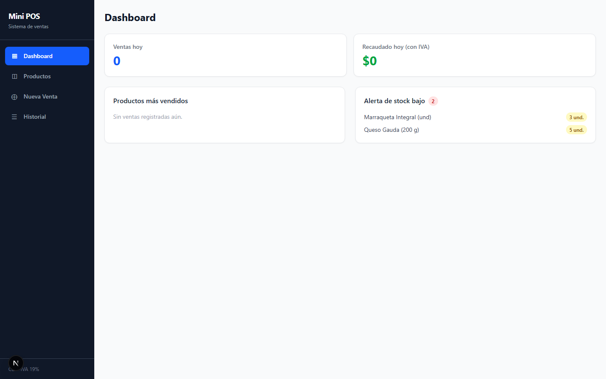
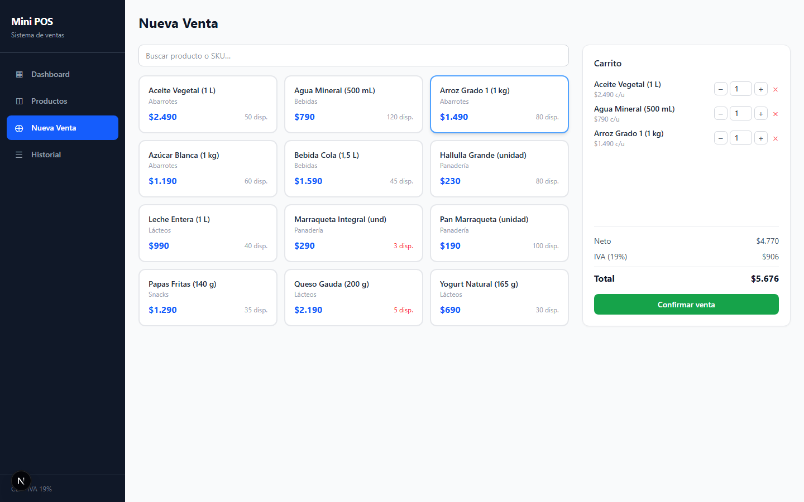

# Mini POS — Next.js

Sistema de punto de venta (POS) construido con **Next.js 16 App Router**, TypeScript, Tailwind CSS y SQLite. Demuestra SSR, SSG/ISR, Route Handlers, testing con Vitest y CI/CD con GitHub Actions.

## Capturas

### Dashboard (SSR — renderizado en servidor en cada request)


### Nueva Venta (Client Component — checkout con IVA 19%)


---

## Funcionalidades

- **Dashboard** — KPIs del día (ventas, recaudado), productos más vendidos y alerta de stock bajo
- **Productos** — catálogo con CRUD (crear, editar, desactivar), filtro por categoría
- **Nueva Venta** — checkout con carrito, búsqueda por nombre/SKU, cálculo de IVA 19% en tiempo real
- **Historial** — listado de ventas con detalle expandible por ítem
- **12 productos chilenos** en 5 categorías (Abarrotes, Lácteos, Panadería, Bebidas, Snacks)
- **Moneda CLP** y IVA 19% conforme a la normativa chilena

---

## Stack técnico

| Capa | Tecnología |
|------|-----------|
| Framework | Next.js 16 (App Router) |
| Lenguaje | TypeScript 5 |
| Estilos | Tailwind CSS 4 |
| Base de datos | SQLite vía `better-sqlite3` |
| Testing | Vitest + React Testing Library |
| Linting | ESLint + eslint-config-next |
| CI/CD | GitHub Actions |

---

## SSR vs SSG — Cuál página es cuál

| Ruta | Estrategia | Motivo |
|------|-----------|--------|
| `/dashboard` | **SSR** (`dynamic = 'force-dynamic'`) | Los KPIs del día cambian en cada request |
| `/productos` | **SSG + ISR** (`revalidate = 60`) | Categorías estáticas; se regeneran cada 60 s |
| `/nueva-venta` | **CSR** (Client Component) | Estado de carrito y interactividad en tiempo real |
| `/historial` | **CSR** (Client Component) | Detalle expandible de ventas interactivo |
| `app/api/*` | **Route Handlers** (`dynamic = 'force-dynamic'`) | APIs REST con SQLite, siempre actualizadas |

---

## Cómo correr

### Requisitos

- Node.js 20 o superior (probado con v24)
- npm 10+

### Instalación

```bash
git clone <repo-url>
cd mini-pos-next
npm install
```

### Desarrollo

```bash
npm run dev
# Abre http://localhost:3000
```

La base de datos SQLite (`data/mini-pos.db`) se crea y siembra automáticamente en el primer arranque con 5 categorías y 12 productos.

### Producción

```bash
npm run build
npm start
```

---

## Scripts disponibles

| Comando | Descripción |
|---------|-------------|
| `npm run dev` | Servidor de desarrollo (hot reload) |
| `npm run build` | Build de producción optimizado |
| `npm start` | Servidor de producción |
| `npm test` | Tests unitarios y de integración (Vitest) |
| `npm run test:watch` | Tests en modo watch |
| `npm run lint` | Lint del código (ESLint) |
| `npm run typecheck` | Verificación de tipos (tsc --noEmit) |

---

## Testing

Los tests están en `__tests__/` y cubren:

| Archivo | Tipo | Qué prueba |
|---------|------|-----------|
| `iva.test.ts` | **Unit** | `calcIVA`, `calcTotal`, `IVA_RATE = 0.19`, casos borde |
| `format.test.ts` | **Unit** | `formatCLP` (moneda CLP) y `formatDate` |
| `ErrorAlert.test.tsx` | **Componente** | Render y atributos del componente de error |
| `api-products.test.ts` | **Integración** | Lógica de DB con SQLite en memoria: productos, ventas, stock |

```bash
npm test
# 4 suites · 21 tests · todos pasan
```

---

## CI/CD

El workflow `.github/workflows/ci.yml` se ejecuta en cada push y PR:

```
push/PR → install → lint → typecheck → test → build
```

Usa Node.js 22 en ubuntu-latest. Todos los pasos deben pasar para que el CI sea verde.

---

## Estructura del proyecto

```
mini-pos-next/
├── app/
│   ├── (pos)/              # Route group — layout con sidebar
│   │   ├── dashboard/      # SSR — datos del día
│   │   ├── productos/      # SSG+ISR — catálogo y CRUD
│   │   ├── nueva-venta/    # CSR — checkout interactivo
│   │   └── historial/      # CSR — historial expandible
│   ├── api/                # Route Handlers (REST)
│   │   ├── products/
│   │   ├── categories/
│   │   ├── sales/
│   │   └── dashboard/
│   ├── layout.tsx          # Layout raíz
│   └── page.tsx            # Redirect a /dashboard
├── components/             # Componentes compartidos
├── lib/
│   ├── db.ts               # Singleton SQLite + seed automático
│   └── format.ts           # Helpers CLP y fecha
├── types/
│   └── index.ts            # Tipos de dominio + helpers IVA
├── __tests__/              # Tests Vitest
├── docs/screenshots/       # Capturas de pantalla
└── .github/workflows/      # CI/CD GitHub Actions
```

---

## Licencia

MIT
